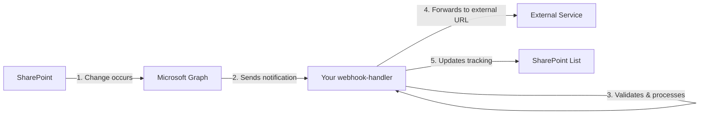

# SharePoint Webhook Proxy Feature

## Overview

The SharePoint Webhook Proxy feature allows external services to receive SharePoint notifications without implementing Microsoft's webhook validation protocol. Your webhook solution acts as a broker, handling all Microsoft requirements while forwarding notifications to any HTTP endpoint.

## How It Works



## Features

### 1. Automatic Forwarding
- Notifications are automatically forwarded based on the `clientState` value
- No code changes required for new endpoints
- Each webhook can forward to a different URL

### 2. Enriched Payloads
External services receive enriched notification data:
```json
{
    "timestamp": "2025-08-04T10:30:00Z",
    "source": "SharePoint-Webhook-Proxy",
    "notification": {
        // Original SharePoint notification
    },
    "metadata": {
        "processedBy": "webhook-functions-sharepoint-002",
        "environment": "production"
    }
}
```

### 3. SharePoint List Tracking
The webhook management list tracks:
- **ClientState**: The full clientState value
- **ForwardingUrl**: Extracted destination URL
- **IsProxy**: Whether this webhook forwards notifications
- **LastForwardedDateTime**: When the last notification was forwarded

## Setting Up a Proxy Webhook

### Method 1: Using clientState Format

Create a webhook with a specially formatted clientState:

```bash
curl -X POST "https://webhook-functions-sharepoint-002.azurewebsites.net/api/subscription-manager?code=YOUR_FUNCTION_KEY" \
  -H "Content-Type: application/json" \
  -d '{
    "resource": "sites/TENANT.sharepoint.com:/sites/SITE:/lists/LIST_ID",
    "changeType": "updated",
    "notificationUrl": "https://webhook-functions-sharepoint-002.azurewebsites.net/api/webhook-handler",
    "clientState": "forward:https://your-external-service.com/webhook"
  }'
```

The `clientState` must start with `forward:` followed by the destination URL.

### Method 2: Test with webhook.site

1. Get a webhook.site URL: https://webhook.site
2. Create a webhook:

```bash
curl -X POST "https://webhook-functions-sharepoint-002.azurewebsites.net/api/subscription-manager?code=YOUR_FUNCTION_KEY" \
  -H "Content-Type: application/json" \
  -d '{
    "resource": "sites/fambrandsllc.sharepoint.com:/sites/sphookmanagement:/lists/82a105da-8206-4bd0-851b-d3f2260043f4",
    "changeType": "updated",
    "notificationUrl": "https://webhook-functions-sharepoint-002.azurewebsites.net/api/webhook-handler",
    "clientState": "forward:https://webhook.site/YOUR-UNIQUE-ID"
  }'
```

## Configuration

### Environment Variables (Optional)

- `INCLUDE_ENRICHED_DATA`: Set to "true" to include additional enrichment
- `ENVIRONMENT`: Environment name included in forwarded metadata

## Forwarded Payload Structure

External endpoints receive a POST request with:

### Headers
```
Content-Type: application/json
X-SharePoint-Webhook-Proxy: true
X-Original-Subscription-Id: {subscription-id}
```

### Body
```json
{
    "timestamp": "2025-08-04T10:30:00.000Z",
    "source": "SharePoint-Webhook-Proxy",
    "notification": {
        "subscriptionId": "...",
        "clientState": "forward:https://your-service.com/webhook",
        "expirationDateTime": "2025-08-07T00:00:00.0000000Z",
        "resource": "sites/.../lists/...",
        "tenantId": "...",
        "siteUrl": "...",
        "webId": "...",
        "changeType": "updated",
        "resourceData": {
            // SharePoint resource data
        }
    },
    "metadata": {
        "processedBy": "webhook-functions-sharepoint-002",
        "environment": "production"
    },
    "enrichedData": {
        // Optional enriched data when INCLUDE_ENRICHED_DATA=true
    }
}
```

## Monitoring

### SharePoint List View
Navigate to your webhook management list to see:
- Which webhooks are configured for forwarding
- Where they forward to
- When they last forwarded a notification
- Total notification count

### Function Logs
The webhook-handler logs:
- Forwarding attempts
- Success/failure status
- Response times
- Error details

## Error Handling

- **Forwarding failures don't affect SharePoint processing**: The webhook continues to work even if forwarding fails
- **10-second timeout**: External endpoints must respond within 10 seconds
- **No retries**: Failed forwards are logged but not retried (implement your own queue if needed)

## Security Considerations

1. **URL Validation**: Consider validating forwarding URLs against an allowlist
2. **Authentication**: Add authentication tokens in the clientState if needed:
   ```
   clientState: "forward:https://api.com/webhook?token=secret123"
   ```
3. **HTTPS Only**: Consider restricting forwarding to HTTPS endpoints only
4. **Rate Limiting**: Monitor for excessive forwarding to prevent abuse

## Examples

### Example 1: Forward to Internal API
```json
{
    "clientState": "forward:https://internal-api.company.com/sharepoint-changes"
}
```

### Example 2: Forward with Query Parameters
```json
{
    "clientState": "forward:https://api.partner.com/webhook?source=sharepoint&list=documents"
}
```

### Example 3: Debugging with webhook.site
```json
{
    "clientState": "forward:https://webhook.site/f923c102-eab3-46e7-80c6-21553d0d923f"
}
```

## Troubleshooting

### Webhook Not Forwarding
1. Check the clientState starts with `forward:`
2. Verify the webhook shows `IsProxy: Yes` in SharePoint list
3. Check function logs for forwarding attempts

### External Service Not Receiving
1. Verify the URL is accessible from Azure
2. Check if the service can handle POST requests
3. Ensure the service responds within 10 seconds
4. Look for errors in the function logs

### SharePoint List Not Updating
1. Ensure the new columns exist in your SharePoint list
2. Check function has permissions to update the list
3. Verify the webhook appears in the list after creation

## Future Enhancements

Consider these improvements:
- Queue failed forwards for retry
- Support for multiple forward destinations
- Webhook transformation/filtering
- Authentication token management
- Forward only specific change types